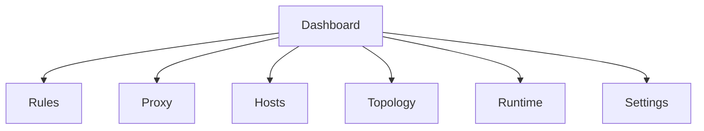

# 三期 Hosts 与 Proxy 模块设计

## 1. 文档信息

- 项目名称：`wsl-bridge`
- 文档版本：`v1.0`
- 更新时间：`2026-05-15`
- 目标读者：产品、研发、测试

## 2. 背景与目标

### 2.1 一期与二期现状

当前项目已具备以下能力：

- Tauri 2 单应用架构
- WSL / Hyper-V 拓扑探测
- `tcp_fwd / udp_fwd / http_proxy / socks5_proxy` 规则执行
- 防火墙按 Profile 配置
- 流量监控、日志体系、托盘与关闭拦截

当前 `Rules` 模块的数据模型仍以单条 `ProxyRule` 为中心，更适合“端口级转发/代理”，不适合承载以下能力：

- 基于 `server_name` 的虚拟主机分流
- TLS 终止
- URL 级上游与路径前缀改写
- WebSocket 与 gRPC 反向代理
- 证书管理与 HTTPS 配置

同时，系统级 `hosts` 管理也是独立的配置域，不应混入现有 `Rules` 模块。

### 2.2 三期目标

三期目标拆为两个新能力域：

1. **Hosts 模块**
   - 以结构化表格管理多套 `hosts` 分组
   - 支持首次从系统 `hosts` 导入 `default` 分组
   - 支持分组复制、删除、导入、导出
   - 任意时刻仅允许一个分组整体写入系统 `hosts` 文件

2. **Proxy 模块**
   - 新增独立 `Proxy` Tab，承载新的 HTTP/HTTPS 反向代理能力
   - 采用 **TLS 终止 + 反向代理** 方案
   - 支持 `server_name`、Nginx 兼容通配符、默认路由
   - 支持 `WSL / Hyper-V / Static` 三类上游
   - 支持 URL 级上游、`path prefix` 改写、WebSocket、gRPC
   - 支持手动上传证书与本地 CA 引导生成

### 2.3 本期不采用的方案

- 不引入 Nginx 作为数据面执行器
- 不将 `Hosts` 合并到 `Rules` Tab
- 不对所有旧规则做一次性 destructive migration
- 不默认启用 HTTPS；新建 Proxy 规则默认走 HTTP

## 3. 信息架构调整

三期后页面信息架构调整为：

### 3.1 Rules

保留为 legacy 模块：

- 可继续使用
- 仅支持 `udp_fwd / socks5_proxy`
- 不允许新增 `tcp_fwd / http_proxy`
- 已有 `tcp_fwd / http_proxy` 进入迁移流

### 3.2 Proxy

新增为正式能力入口：

- 面向 HTTP / HTTPS 反向代理
- 使用新的数据模型与运行引擎
- 承担后续所有 `server_name` 与 TLS 能力扩展

### 3.3 Hosts

新增独立 Tab：

- 只在管理员权限下可编辑或生效
- 非管理员不隐藏入口，但页面中展示“需管理员运行”的限制提示

## 4. Hosts 模块设计

### 4.1 需求边界

Hosts 模块采用结构化管理，不直接把数据库当作“原始文本存储”。

每条 Hosts 记录包含：

- `ip`：支持 IPv4 / IPv6
- `domain`：单域名
- `comment`：备注
- `enabled`：是否启用

一个分组包含多条 Hosts 记录；任意时刻仅允许一个分组生效。

### 4.2 核心用户流

1. 用户首次打开 `Hosts` 页面
2. 系统检测数据库中是否已有 hosts 分组
3. 若无，则读取系统 `hosts` 文件并导入为 `default` 分组
4. 用户可新建、复制、编辑、删除、导入、导出分组
5. 用户点击“设为生效”后，将该分组整体写入系统 `hosts`

### 4.3 数据模型

#### 4.3.1 `hosts_group`

| 字段 | 类型 | 说明 |
|------|------|------|
| `id` | TEXT PK | UUID |
| `name` | TEXT | 分组名称 |
| `description` | TEXT NULL | 分组描述 |
| `source_type` | TEXT | `system_imported \| copied \| manual \| file_imported` |
| `is_active` | INTEGER | 是否当前生效 |
| `created_at` | INTEGER | 创建时间 |
| `updated_at` | INTEGER | 更新时间 |

#### 4.3.2 `hosts_entry`

| 字段 | 类型 | 说明 |
|------|------|------|
| `id` | TEXT PK | UUID |
| `group_id` | TEXT FK | 所属分组 |
| `ip` | TEXT | IPv4 / IPv6 |
| `domain` | TEXT | 单域名 |
| `comment` | TEXT NULL | 备注 |
| `enabled` | INTEGER | 是否启用 |
| `order_index` | INTEGER | 展示与导出顺序 |
| `created_at` | INTEGER | 创建时间 |
| `updated_at` | INTEGER | 更新时间 |

### 4.4 系统 Hosts 文件策略

三期采用“整体写入当前分组”的业务语义：

- 数据源以数据库为准
- 用户选择某个分组生效时，系统根据该分组渲染完整 `hosts` 内容并写入系统文件
- 导入/导出格式与系统 `hosts` 文件保持一致

建议实现细节：

1. 解析器按行读取系统 `hosts`
2. 对可识别的 `ip + domain + optional comment` 行转为结构化记录
3. 无法识别的纯注释行在首次导入时按备注保留到相邻记录；若无法归属，则写入导入报告
4. 导出时按 `order_index` 输出，禁用记录不写入有效映射

### 4.5 权限与 UX

1. 非管理员打开 `Hosts` Tab：
   - 展示页面
   - 顶部横幅提示“需管理员权限”
   - 禁用“设为生效”“导入系统 hosts”“保存到系统 hosts”等写操作
2. 管理员模式：
   - 允许完整读写与切换

### 4.6 UI 设计

#### 4.6.1 分组区

- 左侧分组列表
- 操作：新建、复制、删除、导入、导出、设为生效
- 当前生效分组带状态徽章

#### 4.6.2 表格区

列定义：

- `enabled`
- `ip`
- `domain`
- `comment`
- `actions`

交互要求：

- 支持行内编辑
- 支持批量启用/禁用
- 支持校验 IP 合法性与域名非空
- 支持按分组维度保存

## 5. Proxy 模块设计

### 5.1 目标定位

`Proxy` 模块是三期新增的反向代理能力中心，用于替代旧 `Rules` 中与 HTTP/TCP 入口相关的可演进能力。

采用 **TLS 终止 + 反向代理** 方案的直接收益：

- HTTPS 请求可被解密与理解
- 可读取 `Host`、路径、协议升级信息
- 可实现 `server_name` 分流
- 可实现路径前缀改写
- 可实现 WebSocket 反向代理
- 可实现 gRPC 反向代理

### 5.2 新建规则默认值

为降低表单复杂度，新建 Proxy 规则默认按 HTTP 初始化：

- 协议默认 `http`
- HTTPS 默认关闭
- 不默认创建证书配置
- 不默认添加路径改写规则
- 默认仅创建最小可运行的 listener / route / upstream 草稿

### 5.3 数据模型

#### 5.3.1 `proxy_listener`

| 字段 | 类型 | 说明 |
|------|------|------|
| `id` | TEXT PK | UUID |
| `name` | TEXT | 监听器名称 |
| `listen_host` | TEXT | 监听地址 |
| `listen_port` | INTEGER | 监听端口 |
| `protocol` | TEXT | `http \| https` |
| `tls_mode` | TEXT | `disabled \| manual_cert \| local_ca` |
| `cert_id` | TEXT NULL | 关联证书 |
| `bind_mode` | TEXT | `single_nic \| all_nics` |
| `nic_id` | TEXT NULL | 单网卡模式所选网卡 |
| `enabled` | INTEGER | 是否启用 |
| `created_at` | INTEGER | 创建时间 |
| `updated_at` | INTEGER | 更新时间 |

#### 5.3.2 `proxy_route`

| 字段 | 类型 | 说明 |
|------|------|------|
| `id` | TEXT PK | UUID |
| `listener_id` | TEXT FK | 所属监听器 |
| `server_names_json` | TEXT | JSON 数组 |
| `path_prefix` | TEXT NULL | 匹配的路径前缀 |
| `is_default` | INTEGER | 是否默认路由 |
| `enabled` | INTEGER | 是否启用 |
| `created_at` | INTEGER | 创建时间 |
| `updated_at` | INTEGER | 更新时间 |

#### 5.3.3 `proxy_upstream`

| 字段 | 类型 | 说明 |
|------|------|------|
| `id` | TEXT PK | UUID |
| `route_id` | TEXT FK | 所属路由 |
| `target_kind` | TEXT | `wsl \| hyperv \| static` |
| `target_ref` | TEXT NULL | 目标引用 |
| `target_host` | TEXT NULL | 静态 Host 或解析后回填 |
| `target_port` | INTEGER | 目标端口 |
| `upstream_scheme` | TEXT | `http \| https \| ws \| wss \| grpc \| grpcs` |
| `path_rewrite_from` | TEXT NULL | 改写前缀 |
| `path_rewrite_to` | TEXT NULL | 改写后前缀 |
| `enabled` | INTEGER | 是否启用 |
| `created_at` | INTEGER | 创建时间 |
| `updated_at` | INTEGER | 更新时间 |

#### 5.3.4 `proxy_certificate`

| 字段 | 类型 | 说明 |
|------|------|------|
| `id` | TEXT PK | UUID |
| `name` | TEXT | 证书名称 |
| `source_type` | TEXT | `manual_upload \| local_ca_generated` |
| `cert_path` | TEXT | 证书文件路径 |
| `key_path` | TEXT | 私钥文件路径 |
| `domains_json` | TEXT | 域名列表 |
| `created_at` | INTEGER | 创建时间 |
| `updated_at` | INTEGER | 更新时间 |

### 5.4 路由匹配规则

同一 `listener` 下，路由匹配遵循以下顺序：

1. 仅启用且配置合法的路由参与匹配
2. 精确域名优先
3. Nginx 兼容通配符域名次之
4. 默认路由最后匹配
5. 同类冲突按 `created_at` 倒序，最新创建优先
6. 禁用或失效路由不参与匹配
7. 若默认路由存在但不可用，则拒绝请求并写入错误日志

### 5.5 Nginx 兼容通配符语义

三期仅兼容对 GUI 与规则匹配最有价值的 Nginx 语义：

- 精确匹配：`a.example.com`
- 前缀通配符：`*.example.com`
- 根域与子域兼容写法：`.example.com`

不在三期支持复杂正则风格 `server_name`。

### 5.6 URL 与路径改写能力

三期只支持 **path prefix 改写**，不支持通用 rewrite 表达式。

示例：

- 匹配前缀：`/api`
- 改写为：`/`
- 请求：`/api/users`
- 上游收到：`/users`

这样可以覆盖本地开发最常见的“统一入口 + 子路径分发”场景，并避免 GUI 与验证规则过度复杂。

### 5.7 上游类型

Proxy 上游必须支持三类目标：

1. `wsl`
   - 根据 `target_ref` 动态解析目标 IP
2. `hyperv`
   - 根据 `target_ref` 动态解析目标 IP
3. `static`
   - 用户直接提供 `target_host + target_port`

### 5.8 协议能力

三期 Proxy 支持以下协议能力：

1. `HTTP`
2. `HTTPS`
3. `WebSocket`
4. `gRPC`

具体策略：

- `WebSocket`：复用 HTTP/HTTPS listener，在 Upgrade 场景切换到双向流转发
- `gRPC`：要求 HTTP/2 能力，优先落地 `h2 + TLS` 场景

### 5.9 运行与日志

Proxy 模块应有独立的运行态与日志可观测性：

- listener 运行状态
- route 命中统计
- upstream 连接失败原因
- TLS 握手错误
- 默认路由回退情况

建议新增日志字段：

- `listener_id`
- `route_id`
- `upstream_id`
- `server_name`
- `request_path`
- `upstream_scheme`
- `tls_enabled`

### 5.10 Proxy 三期收敛结论

截至 `2026-05-15`，Proxy 三期按“功能可用、测试面基本完整、允许保留明确技术债务”的口径收敛。

当前已收敛能力：

- HTTP listener / route / upstream 主链路
- HTTPS listener + TLS 终止
- 手动证书上传与本地 CA 引导生成
- `server_name` 精确匹配、Nginx 兼容通配符与默认路由
- `WSL / Hyper-V / Static` 三类上游
- `http / https / ws / wss / grpc / grpcs` 运行时主链路
- route / upstream 级运行态与错误指标
- 上游 TLS 信任链校验
  - 系统根证书
  - 应用本地 CA 根证书
- 旧 `Rules -> Proxy` 迁移、回滚与 legacy 限制

三期收敛时明确保留一项技术债务：

- `grpcs` 的 **Windows 本地稳定端到端自动化回放**
  - 已有配置级、运行态、信任链与错误记账的稳定自动化覆盖
  - `grpcs(h2 over TLS)` 运行时链路已接入
  - 但 `TLS client -> HTTPS Listener -> grpcs TLS upstream` 的 Windows 本地自动回放仍可能出现 `10053` 连接中止
  - 该项列为三期债务，不阻塞 Proxy 模块按当前口径收敛

## 6. TLS 与证书方案

### 6.1 方案选择

三期 HTTPS 采用 **TLS 终止**：

- 客户端与 `wsl-bridge` 建立 TLS
- 应用完成证书选择、TLS 握手与解密
- 再按 HTTP 层规则做反向代理

### 6.2 支持的证书来源

#### 6.2.1 用户手动上传

用户提供：

- 证书文件
- 私钥文件
- 证书适用域名

适合：

- 已有开发证书
- 团队内统一颁发证书
- 企业内网环境

#### 6.2.2 本地 CA 引导生成

应用提供本地 CA 引导能力：

1. 生成本地 CA
2. 引导用户安装到受信任根证书存储
3. 基于该 CA 为指定 `server_name` 生成开发证书

适合：

- 本地开发环境
- 临时 HTTPS 联调

### 6.3 三期边界

三期只做以下能力：

- 手动上传证书
- 本地 CA 引导生成
- 证书与 listener 绑定
- 域名与证书适配校验

三期不做：

- 自动续期
- ACME / Let's Encrypt
- 远程证书托管

## 7. Legacy Rules 策略

### 7.1 保留原则

旧 `Rules` 模块不删除，作为 legacy 模块继续存在。

保留原因：

- 避免一次性替换造成行为回归
- `udp_fwd / socks5_proxy` 与新 Proxy 体系不是同一抽象
- 允许用户按模块逐步迁移

### 7.2 功能限制

三期后 `Rules` 模块限制为：

- 仍可查看全部旧规则
- 仅允许新增 `udp_fwd / socks5_proxy`
- 禁止新增 `tcp_fwd / http_proxy`

页面需对 `tcp_fwd / http_proxy` 显示：

- `待迁移`
- `已迁移`
- `Legacy`

## 8. 旧规则迁移方案

### 8.1 迁移总原则

采用 **迁移向导 + 自动迁移 + 可回滚** 方案：

- 不做 destructive migration
- 自动迁移成功后保留旧规则记录
- 旧规则改为禁用并标记 `migrated`
- 用户可查看迁移结果并回滚

### 8.2 `tcp_fwd` 自动迁移

`tcp_fwd` 自动迁移到 Proxy 时，生成：

1. 一个 `proxy_listener`
2. 一个默认 `proxy_route`
3. 一个 `proxy_upstream`

迁移规则：

- `listen_host / listen_port / bind_mode / nic_id` 原样映射
- 默认协议为 `http`
- 默认不启用 HTTPS
- 默认无路径改写
- route 为默认路由

说明：

该迁移适用于“旧 TCP 入口实际承载 HTTP 服务”的主路径。若目标服务不是 HTTP 协议，应在迁移预览中明确提示用户人工确认。

### 8.3 `http_proxy` 自动迁移

`http_proxy` 自动迁移到 Proxy 时，生成：

1. 一个 `http` listener
2. 一个 route
3. 一个 upstream

默认值：

- `server_names = ["127.0.0.1", "localhost"]`
- 默认不启用 HTTPS
- 默认没有路径改写规则

说明：

使用 `127.0.0.1 + localhost` 作为迁移默认值，比单独使用 `127.0.0.1` 兼容性更高，可减少用户在浏览器使用 `localhost` 时出现的隐性不命中问题。

### 8.4 不迁移项

以下规则不迁入 Proxy：

- `udp_fwd`
- `socks5_proxy`

它们继续留在 legacy `Rules` 中维护。

### 8.5 迁移入口设计

建议提供两类入口：

1. 首次进入 `Proxy` Tab 时的迁移引导横幅
2. `Rules` 页面每条可迁移规则上的“迁移到 Proxy”操作

迁移流程：

1. 扫描可迁移规则
2. 生成迁移预览
3. 用户确认
4. 写入 Proxy 新表
5. 标记旧规则为 `migrated + disabled`
6. 写入迁移审计日志

## 9. Rust 原生实现策略

### 9.1 结论

三期明确 **不引入 Nginx**，采用 Rust 原生实现。

### 9.2 原因

1. 保持单应用统一控制面与数据面
2. 运行态、日志、流量统计不需要跨进程拼接
3. 避免在 Windows 桌面应用中额外分发与维护 `nginx.exe`
4. 避免“双数据面”导致的心智负担和排障复杂度

### 9.3 技术挑战

Rust 原生实现的主要挑战集中在：

1. TLS 终止
2. HTTP/1.1 + HTTP/2 统一代理
3. WebSocket Upgrade 转发
4. gRPC over HTTP/2
5. 证书装载与本地 CA 生成

建议以独立执行器模块实现，不复用现有 `forwarder.rs` 的单纯 TCP/UDP/正向代理模型。

## 10. API 与前后端接口建议

### 10.1 Hosts

建议新增命令：

1. `list_hosts_groups()`
2. `create_hosts_group()`
3. `copy_hosts_group()`
4. `delete_hosts_group()`
5. `list_hosts_entries(group_id)`
6. `save_hosts_entries(group_id, entries)`
7. `import_hosts_group_from_file(path)`
8. `export_hosts_group_to_file(group_id, path)`
9. `activate_hosts_group(group_id)`
10. `bootstrap_default_hosts_group()`

### 10.2 Proxy

建议新增命令：

1. `list_proxy_listeners()`
2. `create_proxy_listener()`
3. `update_proxy_listener()`
4. `delete_proxy_listener()`
5. `list_proxy_routes(listener_id)`
6. `create_proxy_route()`
7. `update_proxy_route()`
8. `delete_proxy_route()`
9. `list_proxy_upstreams(route_id)`
10. `create_proxy_upstream()`
11. `update_proxy_upstream()`
12. `delete_proxy_upstream()`
13. `apply_proxy()`
14. `stop_proxy()`
15. `migrate_rule_to_proxy(rule_id)`
16. `list_proxy_certificates()`
17. `upload_proxy_certificate()`
18. `generate_local_ca_certificate()`

## 11. 里程碑建议

### M6.1 Hosts 模块

- Hosts 分组与表格编辑
- 首次系统 `hosts` 导入为 `default`
- 分组复制、删除、导入、导出
- 管理员权限提示与生效切换

### M6.2 Proxy HTTP 核心

- 新 `Proxy` Tab
- 新数据模型与 SQLite 存储
- HTTP listener / route / upstream
- `server_name` 精确匹配
- 默认路由
- 路径前缀改写
- WSL / Hyper-V / Static 上游

### M6.3 Proxy HTTPS

- TLS 终止
- 手动证书上传
- 本地 CA 引导生成
- 证书绑定与域名校验
- Nginx 兼容通配符匹配

### M6.4 高级协议与观测

- WebSocket
- gRPC
- 细粒度访问日志
- route / upstream 级别运行态

### M6.5 Legacy 迁移与收尾

- `tcp_fwd / http_proxy` 迁移向导
- 自动迁移、回滚、状态标记
- `Rules` 页面 legacy 限制收口
- 文档与验收收尾

## 12. 主要风险与应对

### 12.1 HTTPS 与证书复杂度高

风险：

- 用户不理解本地 CA
- 证书与域名不匹配导致代理失败

应对：

- 提供证书向导与清晰提示
- 对 listener 和 route 做预校验
- 错误日志明确到证书与域名层面

### 12.2 gRPC 实现复杂

风险：

- HTTP/2 与 TLS 行为复杂
- 调试成本高

应对：

- 单列里程碑
- 优先支持标准 unary / streaming 透传主路径
- 先确保日志与错误观测可用

### 12.3 旧规则迁移存在语义差异

风险：

- 迁移后的 Proxy 配置与旧行为不完全一致

应对：

- 强制迁移预览
- 保留旧规则记录
- 迁移后默认禁用旧规则但可回滚

### 12.4 Hosts 覆盖系统文件风险

风险：

- 生效分组写入系统文件后，用户误以为原始文件仍保留全部历史内容

应对：

- 明确“数据库分组为唯一配置源”的产品语义
- 生效前提供预览
- 导出当前系统等价文本，便于备份

### 12.5 Proxy 自动化债务

风险：

- `grpcs` 完整端到端自动化在 Windows 本地环境下仍存在回放不稳定性
- 若强行以不稳定用例作为发布门禁，可能造成持续误报并拖慢三期收敛

应对：

- 将该项明确登记为三期技术债务
- 保留以下稳定覆盖作为当前发布依据：
  - `grpcs` 配置约束测试
  - `grpcs` 运行态配置/状态测试
  - 上游 TLS 信任链测试
  - `https / wss` 未受信上游握手失败与错误记账测试
- 后续单独评估更稳定的 HTTPS 本地回放方案，再补强 `grpcs` E2E 自动化

## 13. 验收标准

### 13.1 Hosts

1. 首次进入 `Hosts` 页面时，可将系统 `hosts` 文件导入为 `default` 分组
2. 用户可创建、复制、删除、导入、导出 hosts 分组
3. 用户可通过表格编辑每条 `ip / domain / comment / enabled` 记录
4. 仅一个分组可处于生效状态
5. 生效后系统 `hosts` 文件内容与分组导出结果一致
6. 非管理员模式下不隐藏 Tab，但禁止写入系统文件

### 13.2 Proxy

1. 可创建 HTTP listener，并按 `server_name` 正确分流到不同上游
2. 默认未配置 `server_name` 的路由可接收未命中流量
3. 域名冲突按创建时间倒序匹配，最新规则优先
4. 支持 `*.example.com` 和 `.example.com` 匹配
5. 支持 `path prefix` 改写
6. 支持 HTTPS TLS 终止
7. 支持 WebSocket 与 gRPC 主路径
   - `grpcs(h2 over TLS)` 运行时已接入
   - Windows 本地稳定端到端自动化回放列为三期债务，不作为当前收敛阻塞项
8. 默认路由异常时，应用拒绝请求并写错误日志

### 13.3 Legacy 迁移

1. 旧 `Rules` 保留且可继续管理 `udp_fwd / socks5_proxy`
2. 不允许新增 `tcp_fwd / http_proxy`
3. 可对旧 `tcp_fwd / http_proxy` 发起迁移
4. 迁移后自动生成 Proxy 配置并保留旧规则记录
5. 迁移结果支持审计与回滚
