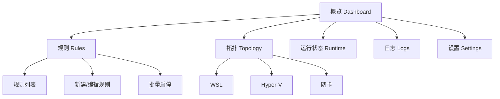
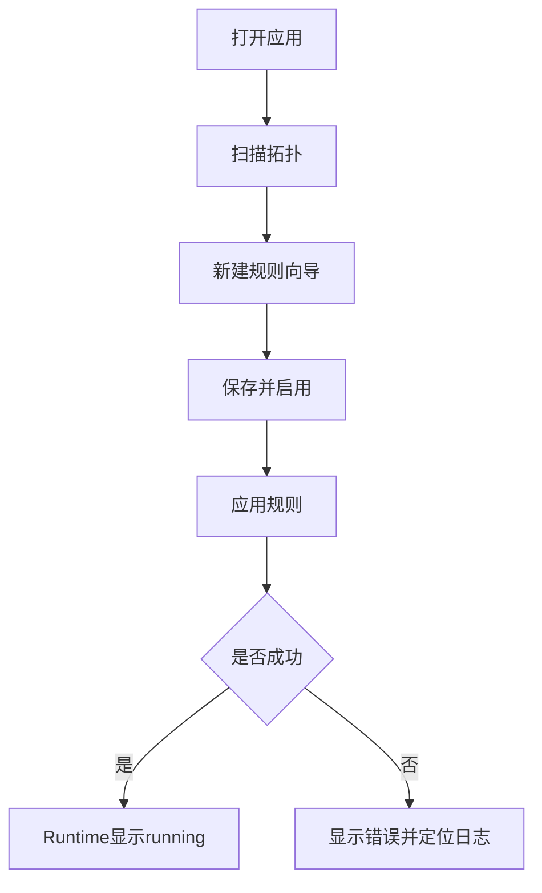
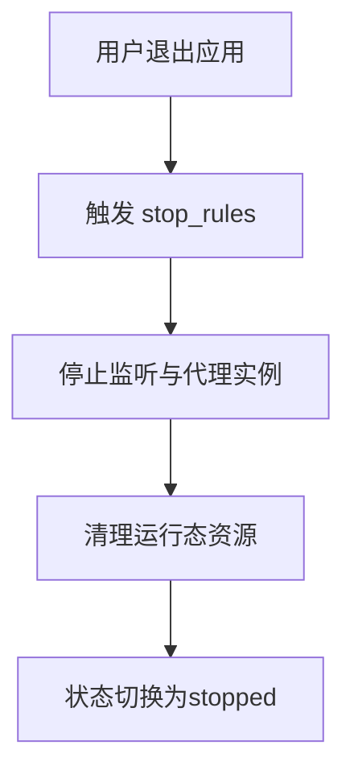

# WSL Bridge UI/UX 设计规范（MVP）

## 1. 设计目标

- 让开发者在 1 分钟内完成首次规则创建并成功应用。
- 降低高风险操作（端口冲突、防火墙误开放、全网卡监听）的误操作概率。
- 保证“应用启动后可应用规则，应用退出后规则停止”的生命周期语义对用户可见且可理解。
- 为 Win10/11 桌面环境提供高信息密度但低认知负担的运维体验。

## 2. 目标用户与场景

- 本地开发者：把 WSL 服务临时暴露给局域网设备调试。
- 测试/联调人员：快速切换 TCP/UDP/HTTP/SOCKS5 规则组合。
- 高级用户：按网卡、按防火墙 Profile 精细控制暴露范围。

## 3. 信息架构（IA）



## 4. 全局布局

- 顶部栏：应用运行状态、规则引擎状态、全局“应用规则/停止规则”主操作。
- 左侧导航：概览、规则、拓扑、运行状态、日志、设置。
- 主内容区：页面主体。
- 底部状态条：应用版本、内核版本、最近一次规则应用时间。

## 5. 关键页面设计

### 5.1 概览（Dashboard）

目标：让用户 10 秒内判断“现在是否安全且可用”。

模块：
- 应用状态卡片：`Ready / Applying / Running / Stopped / Error`。
- 规则卡片：总数、已启用、运行中、错误数。
- 风险提示卡片：检测到 NAT 且无规则时，给出“创建桥接规则”引导。
- 快捷操作：`新建规则`、`扫描拓扑`、`查看错误日志`。

### 5.2 规则页（Rules）

列表列定义：
- 名称
- 类型（TCP/UDP/HTTP/SOCKS5）
- 监听地址（host:port）
- 目标（WSL/Hyper-V/Static）
- 绑定模式（单网卡/所有网卡）
- 防火墙 Profile（D/P/P）
- 状态（running/stopped/error）
- 操作（编辑/启停/删除）

交互：
- 顶部支持类型、目标类型、状态筛选。
- 支持批量启用/禁用。
- 端口冲突在列表和编辑器双重提示。

### 5.3 新建/编辑规则（Rule Editor）

采用 3 步向导，降低配置错误：

1. 基础配置：名称、规则类型、监听 host/port。
2. 目标配置：目标类型（WSL/Hyper-V/Static）与目标地址解析。
3. 网络与安全：绑定模式、防火墙 Profile、启用状态。

动态字段规则：
- `http_proxy/socks5_proxy` 隐藏 `target_port`，显示代理相关说明。
- `single_nic` 时必须选择网卡；`all_nics` 时禁用网卡选择器。
- 目标为 `wsl/hyperv` 时展示“实时 IP 预览”与“最近解析时间”。

### 5.4 拓扑页（Topology）

三区布局：
- WSL 区：发行版、networkingMode、当前 IP、可达性。
- Hyper-V 区：VM、vSwitch、vNIC、IP 映射。
- 网卡区：物理/虚拟网卡、IPv4/IPv6、状态、路由优先级。

提供“将当前目标一键带入新规则”操作。

### 5.5 运行状态页（Runtime）

- 表格展示每条规则运行态：state、last_apply_at、last_error。
- 错误行高亮并提供“查看关联日志”跳转。
- 顶部显示最近一次 Apply 的成功/失败统计。

### 5.6 日志页（Logs）

- 支持按级别、模块、规则 ID 过滤。
- 默认实时 Tail，支持暂停滚动。
- 支持导出当前过滤结果（用于故障分析）。

## 6. 核心用户流

### 6.1 首次创建并应用规则



### 6.2 安全退出



## 7. 设计系统（MVP）

### 7.1 视觉方向

- 风格：工程控制台（高信息密度、低装饰）。
- 主色：蓝灰 + 青色强调；风险操作使用橙/红色语义色。
- 不使用紫色作为主品牌色。

### 7.2 主题模式

支持三种主题模式：
- Light：浅色主题，白色背景 + 深色文字。
- Dark：深色主题，深灰背景 + 浅色文字。
- Auto：跟随系统设置自动切换。

主题切换入口位于 Settings 页面，使用 Segmented Control 控件。

### 7.3 Token（建议）

```css
:root {
  --bg-canvas: #f6f8fb;
  --bg-panel: #ffffff;
  --text-primary: #111827;
  --text-secondary: #475467;
  --brand-600: #0b5fff;
  --ok-600: #067647;
  --warn-600: #b54708;
  --danger-600: #b42318;
  --border-default: #d0d5dd;
  --radius-sm: 4px;
  --radius-md: 6px;
  --radius-lg: 8px;
  --radius-xl: 12px;
  --radius-full: 999px;
  --space-8: 8px;
  --space-12: 12px;
  --space-16: 16px;
}

/* Dark 主题 */
[data-theme="dark"] {
  --bg-canvas: #1a1a1a;
  --bg-panel: #2d2d2d;
  --text-primary: #f5f5f5;
  --text-secondary: #a0a0a0;
  --border-default: #404040;
}
```

### 7.4 排版

- 标题：`20/28`、`16/24`
- 正文：`14/22`
- 表格：`13/20`
- 中文优先字体建议：`"Noto Sans SC", "PingFang SC", sans-serif`

### 7.5 UI 组件库

基于 `@kobalte/core` 实现所有交互组件，确保一致的 Win11 视觉风格与可访问性：

- `Select`：下拉选择器，用于类型筛选、目标选择等场景。
- `Checkbox`：复选框，用于规则列表行选择、批量操作。
- `Switch`：开关，用于启用/禁用状态切换。
- `Dialog`：弹窗，用于规则编辑、确认对话框。
- `TextField`：文本输入，用于名称、端口等表单字段。
- `Tooltip`：提示，用于单元格省略内容的悬浮展示。
- `Button`：按钮，用于所有操作触发。

组件样式统一使用 CSS 变量，支持 Light/Dark 主题自动切换。

## 8. 组件清单

- `StatusBadge`：running/stopped/error/unknown 四态。
- `ProfileSwitchGroup`：Domain/Private/Public 三开关。
- `TargetPicker`：WSL/Hyper-V/Static 联动选择器。
- `PortConflictAlert`：端口占用冲突提示。
- `RuntimeBanner`：应用与规则引擎状态提示。
- `ApplyResultToast`：应用结果摘要（成功数/失败数）。

## 9. 文案与反馈规范

- 成功：明确对象与结果，如“规则 `web-8080` 已运行”。
- 失败：包含原因与建议动作，如“端口 8080 被占用，请更换端口或停止占用进程”。
- 高风险确认：对“所有网卡 + Public 放行”增加二次确认弹窗。

## 10. 可访问性与可用性

- 键盘可达：所有表单控件与表格操作可 Tab 访问。
- 焦点可见：2px 高对比描边。
- 对比度：正文与背景满足 WCAG AA。
- 错误提示与字段关联（`aria-describedby`）。
- 表格支持密度切换（舒适/紧凑）以适应小屏笔记本。

## 11. 响应式策略

- >=1280：三栏信息布局（概览卡片并排）。
- 960-1279：两栏布局。
- <960：导航折叠为抽屉，表格优先横向滚动，不强制卡片化。

## 12. 页面线框（文本）

```txt
┌──────────────────────────────────────────────────────────────┐
│ WSL Bridge | App: Ready | Engine: Running | [应用规则] [停止] │
├───────────────┬──────────────────────────────────────────────┤
│ 导航          │ 概览                                         │
│ - 概览        │ ┌────────────┬────────────┬──────────────┐   │
│ - 规则        │ │ 应用状态   │ 规则状态   │ 风险提示     │   │
│ - 拓扑        │ └────────────┴────────────┴──────────────┘   │
│ - 运行状态    │                                              │
│ - 日志        │ 最近错误 / 快速操作                          │
│ - 设置        │                                              │
├───────────────┴──────────────────────────────────────────────┤
│ app: v0.x | core: v0.x | last apply: 2026-03-02 10:30:21    │
└──────────────────────────────────────────────────────────────┘
```

## 13. 交付建议（对前端）

- 路由：`/dashboard` `/rules` `/rules/new` `/topology` `/runtime` `/logs` `/settings`
- 状态管理：Query 管拓扑与运行态；表单状态与草稿本地管理。
- 表格：规则列表使用可虚拟滚动配置，避免大规则集卡顿。
- 日志：Tail 采用增量 cursor 拉取，支持暂停与继续。
