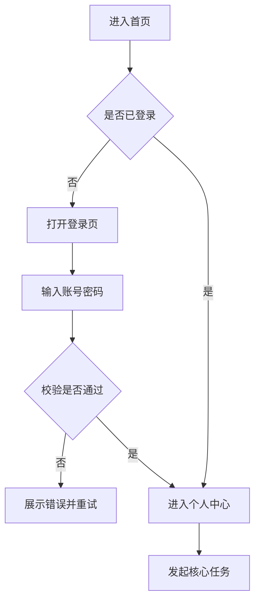
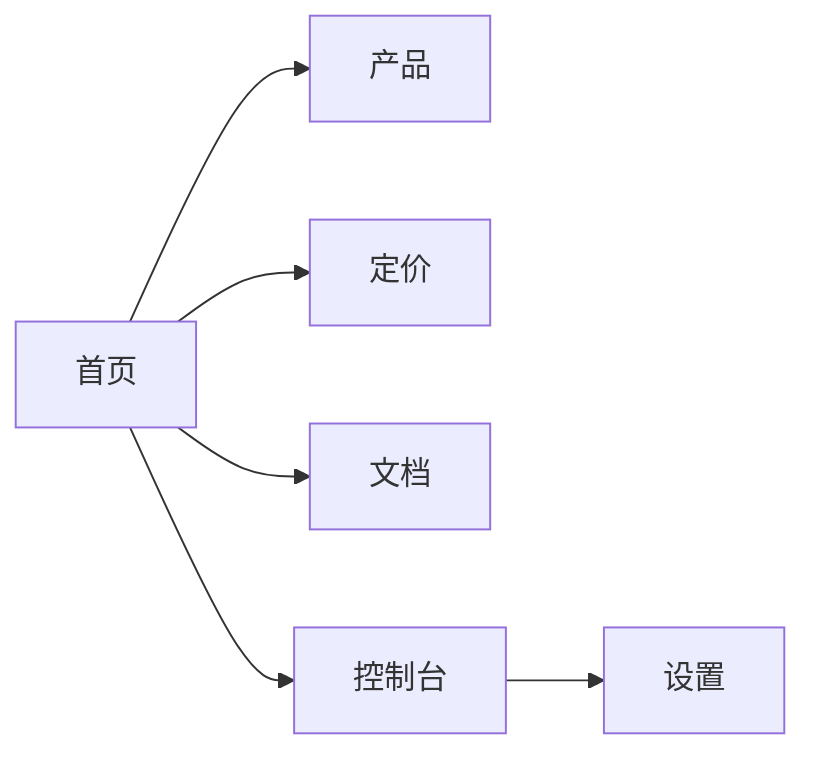
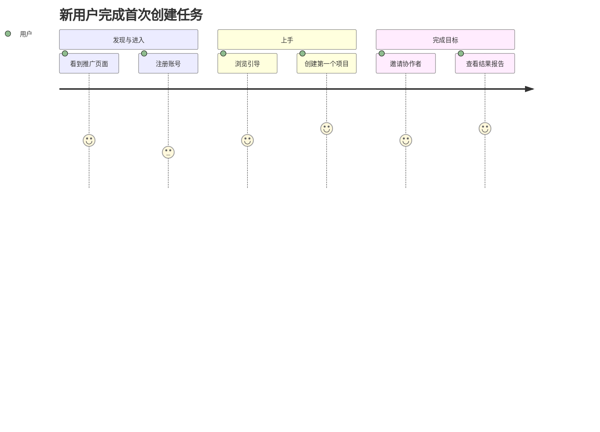
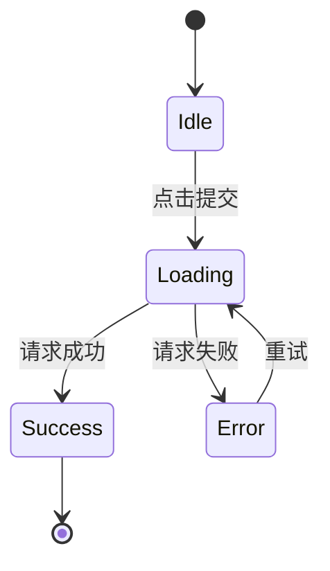

# Mermaid 模板（用户流程与信息架构）

## 使用说明

- 需要表达用户流程、页面关系、状态机时使用本模板。
- 默认先输出简版图，确认后再补充分支与异常流。
- 图中节点名称使用业务语义，避免工程缩写。

## 1) 用户任务流（Flowchart）

适用场景：
- 新用户转化路径
- 表单提交与错误回退路径
- 关键业务闭环梳理

## 2) 站点图 / 信息架构（Graph）

适用场景：
- 多页面网站结构设计
- 导航层级与入口梳理
- 内容分组与归类讨论

## 3) 用户旅程（Journey）

适用场景：
- 体验阶段情绪与阻力识别
- Onboarding 优化
- 关键体验断点定位

## 4) 状态机（State Diagram）

适用场景：
- 复杂组件交互状态定义
- 异步请求状态管理讨论
- 设计与前端行为对齐

## 绘制建议

- 每张图控制在 8-15 个节点，超出时拆分子图。
- 节点文案保持短句，优先“动作 + 对象”。
- 标注关键异常流，避免只画成功路径。
- 对高风险节点补充验收条件（可点击、可返回、可恢复）。
